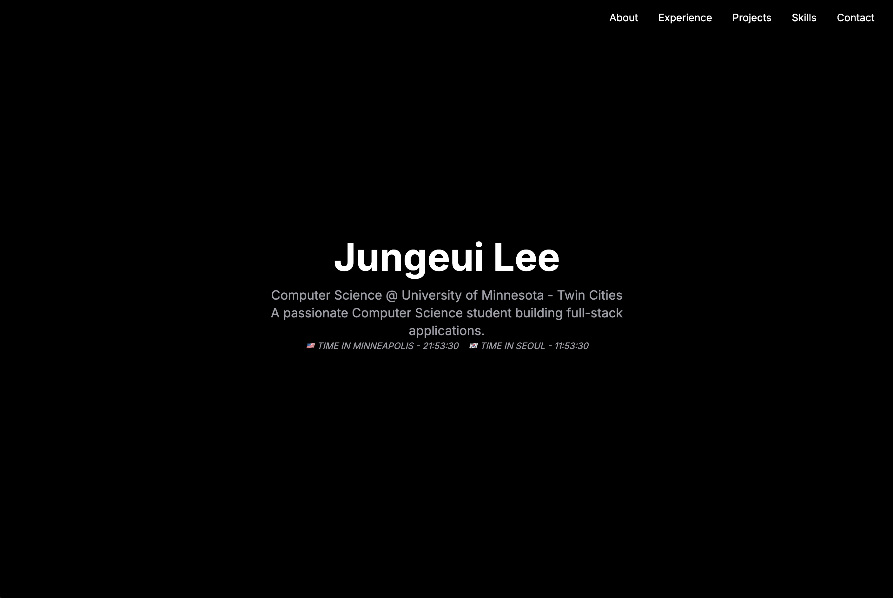

# Jungeui Lee Portfolio

Modern one-page portfolio built with Next.js 16, React 19, and Tailwind CSS 4. The site spotlights education, experience, projects, and skills with interactive touches such as live time-zone clocks and modal project details.



## Highlights
- Hero section shows live clocks for Minneapolis and Seoul, with quick links to dedicated pages
- Clickable project cards open modals with longer descriptions, screenshots, and GitHub links
- Education and military experience displayed via `react-vertical-timeline-component`
- Fully responsive dark UI styled with Tailwind CSS 4
- App Router setup deployable as a static build—no backend services required

## Tech Stack
- **Framework**: Next.js 16 (App Router)
- **Language**: TypeScript with React 19
- **Styling**: Tailwind CSS 4, PostCSS
- **UI Enhancements**: react-vertical-timeline-component, lucide-react icons

## Project Structure
```
src/
  app/
    layout.tsx      # Root layout and metadata
    page.tsx        # Main page composition
    globals.css     # Tailwind-based global styles
  components/
    Hero.tsx        # Hero with live clocks
    About.tsx       # Personal introduction
    Experience.tsx  # Timeline component
    Projects.tsx    # Project cards + modal
    Skills.tsx      # Skills grid
    Contact.tsx     # Contact and external links
public/
  *.png             # Project thumbnails and assets
```

## Getting Started
Node.js 20 or newer is recommended.

```bash
# Install dependencies
npm install

# Start the development server
npm run dev
# Visit http://localhost:3000
```

### Lint & Production Build
```bash
npm run lint    # ESLint checks
npm run build   # Production bundle
npm run start   # Serve the build output
```

## Deployment
Deploy to Vercel, Netlify, or any static-compatible host. Because the site does not rely on environment variables or server-side data sources, deployment configuration remains lightweight.

## Customization Tips
- Modify the `projects` array in `src/components/Projects.tsx` to feature new work.
- Update the `Intl.DateTimeFormat` options in `Hero.tsx` to display different time zones.
- Adjust global colors and typography through `globals.css` or Tailwind theme tokens.

---

Contact: justicelee.dev@gmail.com  
GitHub: https://github.com/JungeuiLee  
LinkedIn: https://www.linkedin.com/in/jungeui-lee-49b264356/
