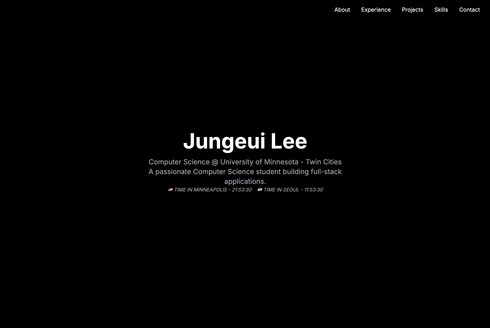

# Jungeui Lee — Portfolio

Personal portfolio site built with Next.js 16, React 19, and Tailwind CSS 4.

**Live:** [jungeui-website.vercel.app](https://jungeui-website.vercel.app/)



## Highlights
- Hero section with live clocks for Minneapolis and Seoul
- Custom alternating experience timeline; each entry opens a detail modal with the technologies used and key achievements
- Project cards linking out to repositories, the App Store listing, and written work
- Fully responsive dark UI styled with Tailwind CSS 4

## Tech Stack
- **Framework**: Next.js 16 (App Router)
- **Language**: TypeScript with React 19
- **Styling**: Tailwind CSS 4, PostCSS
- **Icons**: lucide-react
- **Images**: next/image optimization

## Running Locally
```bash
npm install
npm run dev
```
